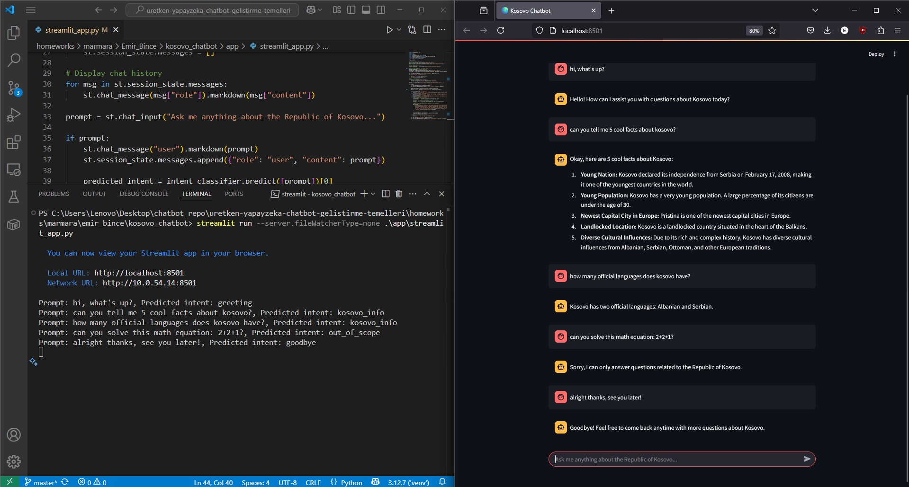
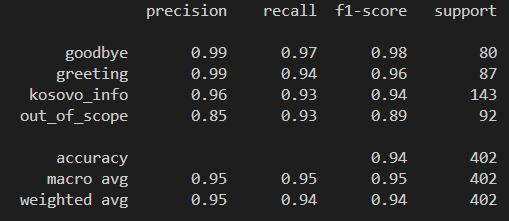
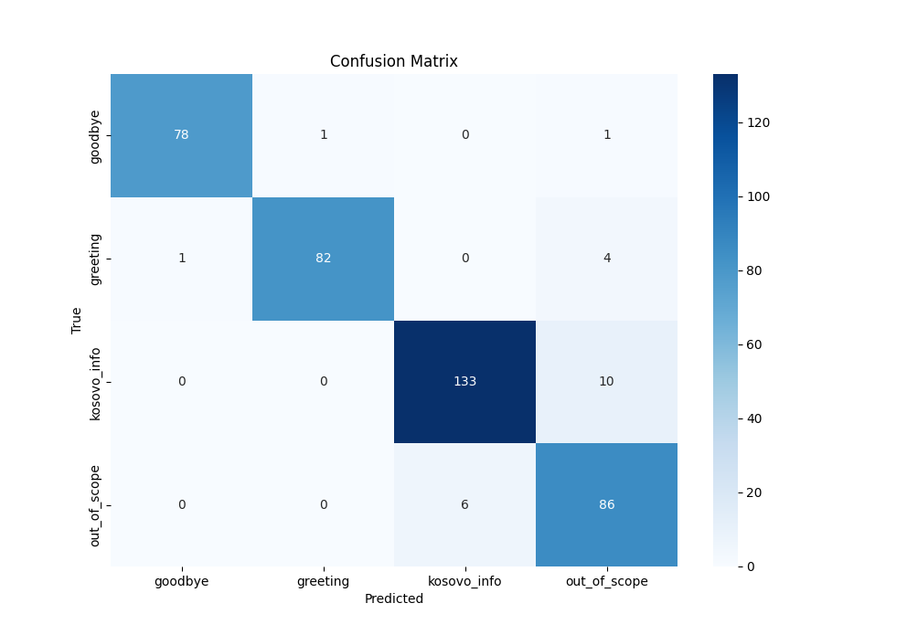

# 🇽🇰 Kosovo Chatbot

A lightweight yet powerful conversational assistant tailored exclusively to answer questions about the **Republic of Kosovo**.

It uses a **custom-trained intent classifier** to route user messages, a **retrieval-augmented generation (RAG)** pipeline backed by **Hugging Face sentence embeddings**, and **Google Gemini 2 Flash** for grounded and informative response generation. Built with **Streamlit** for an interactive, browser-based UI.

---

## 📌 Key Features

✅ **Kosovo-Only Focus**  
✅ **Intent classification** with ~94% accuracy  
✅ **Retrieval-Augmented Generation (RAG)** pipeline for fact-grounded answers  
✅ **Google Gemini 2 Flash** for high-quality responses  
✅ **Graceful fallback for out-of-scope queries**  
✅ **Interactive UI built with Streamlit**  
✅ **Lightweight and fast with local embeddings + Chroma DB**

---

## 🚀 Setup Instructions

### 1. Create and activate a virtual environment

```bash
python -m venv venv
```

- **On Windows:**
  ```bash
  venv\Scripts\activate
  ```
- **On macOS/Linux:**
  ```bash
  source venv/bin/activate
  ```

---

### 2. Install dependencies

```bash
pip install -r requirements.txt
```

---

### 3. Configure Gemini API key

Create a `.env` file in the project root with the following content:

```
GEMINI_API_KEY=your_google_gemini_api_key
```

---

### 4. Train the intent classifier

```bash
python models/train_intent_classifier.py
```

This script uses `TF-IDF` + `LogisticRegression` and is trained on `data/chatbot_dataset.csv`.

- Example intents:
  - `greeting`
  - `goodbye`
  - `kosovo_info`
  - `out_of_scope`

Training output is saved to `models/intent_classifier.joblib`.

---

### 5. (Optional) Evaluate classifier performance

```bash
python models/classifier_stats.py
```

This prints a full `classification_report` and shows a confusion matrix.  
💡 Achieves ~94% overall accuracy.

Sample output:

```
              precision    recall  f1-score   support

     goodbye       0.99      0.97      0.98        80
    greeting       0.99      0.94      0.96        87
 kosovo_info       0.96      0.93      0.94       143
out_of_scope       0.85      0.93      0.89        92

    accuracy                           0.94       402
```

---

### 6. Build the Chroma vector store

This indexes all `.txt` files inside the `data/` directory using `HuggingFaceEmbeddings`:

```bash
python chroma/create_vector_store.py
```

Details:
- Embedding model: `all-MiniLM-L6-v2`
- Chunk size: 500 characters
- Overlap: 50 characters
- Persisted to: `data/chroma_store/`

---

### 7. Run the chatbot

```bash
streamlit run --server.fileWatcherType=none app/streamlit_app.py
```

Then open the Streamlit UI in your browser.

---

## 🧠 How It Works

### 🧭 Intent Classification

Uses a pipeline of:

```python
TfidfVectorizer() + LogisticRegression(max_iter=1000)
```

Intent labels:
- `greeting`: e.g. "hello", "hi there"
- `goodbye`: e.g. "bye", "see you"
- `kosovo_info`: Kosovo-related factual queries
- `out_of_scope`: Anything not about Kosovo

---

### 🔍 RAG (Retrieval-Augmented Generation)

For `kosovo_info` intents:
1. Top-3 relevant document chunks retrieved using cosine similarity in `Chroma` vector store
2. Context + question passed to **Gemini 2 Flash**
3. Gemini is instructed to:
   - Prefer factual Kosovo context
   - Use own knowledge if context is insufficient
   - Reject out-of-scope questions

---

### 🤖 Gemini Prompt Template

```text
You are a helpful assistant who answers questions only about the Republic of Kosovo.
Use the following context to answer the question. It's important to clarify that you are not limited by the context.
Don't be afraid to use your own knowledge if the context is not sufficient.

If the question is unrelated to Kosovo, say you can't answer.

Context:
[retrieved content]

Question:
[user input]
```

---

## 🖼️ UI Preview



---

## 📊 Classifier Performance



---

## 📉 Confusion Matrix



---

## 📁 Project Structure

```
kosovo_chatbot/
├── app/
│   └── streamlit_app.py             # Streamlit app
├── chroma/
│   └── create_vector_store.py       # Build vector store
├── data/
│   ├── chroma_store/                # Persisted Chroma vector store
│   ├── chatbot_dataset.csv          # Intent classification dataset
│   ├── kosovo_*.txt                 # Knowledge base documents
├── images/
│   └── *.png                        # Demo visuals
├── models/
│   ├── train_intent_classifier.py
│   ├── classifier_stats.py
│   └── intent_classifier.joblib     # Trained model
├── .env                             # API key
├── requirements.txt
└── README.md
```

---

## ❓ Example Queries

| Type            | Input                                    | Response Behavior                                     |
|-----------------|------------------------------------------|-------------------------------------------------------|
| Greeting        | "Hi there!"                              | Friendly welcome message                              |
| Kosovo Info     | "What is Kosovo’s population?"           | Pulls RAG + Gemini for answer                         |
| Out-of-Scope    | "What’s the weather in Paris?"           | Graceful rejection: not about Kosovo                  |
| Goodbye         | "See you later"                          | Farewell message                                      |

---

## 📌 Limitations

- Only single-turn interactions (no chat memory)
- Kosovo-only knowledge domain
- Requires Gemini API access

---

## 👥 Contributing

Want to improve it? PRs and issues are welcome!

To contribute:
1. Fork this repo
2. Create a new branch
3. Make your changes
4. Submit a pull request

---

## 📜 License

This project is licensed under the **MIT License**.

---

## 🙏 Acknowledgments

- [Google Gemini](https://deepmind.google/technologies/gemini/)
- [Hugging Face](https://huggingface.co/)
- [ChromaDB](https://www.trychroma.com/)
- [LangChain](https://www.langchain.com/)
- 🇽🇰 Inspired by the people and beauty of Kosovo.
